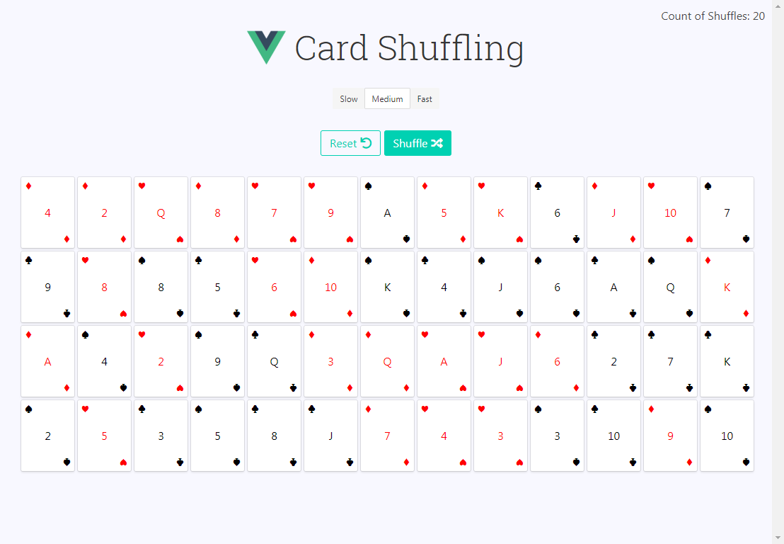

# Shuffle-A-Deck-of-Cards
### Shuffle a Deck of Cards Using Fisher–Yates shuffle

## Using Libraries
Vue@2.5.16  
Font Awesome  
Bulma CSS

## Related Links
[Shuffle a Deck of Cards in Vue.js (Tutorial)](https://medium.com/fullstackio/tutorial-shuffle-a-deck-of-cards-in-vue-js-b65da4c59b1 "Shuffle a Deck of Cards in Vue.js")

[Vue.js](https://vuejs.org/ "Vue.js")

[Bulma (free CSS framework) ](https://bulma.io/ "Bulma")

[fontawesome (Provide Some Icons) ](https://fontawesome.com/ "fontawesome")

